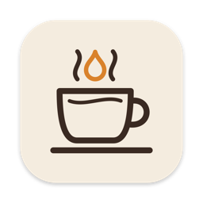
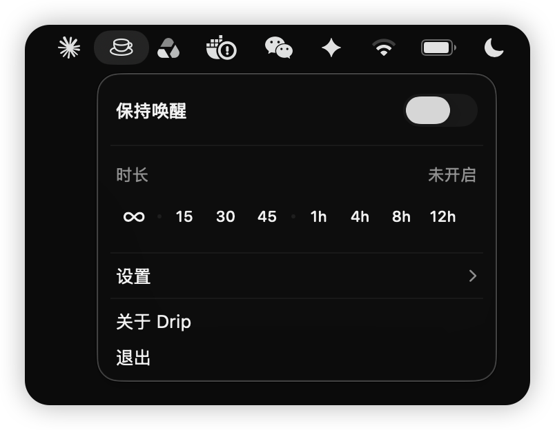
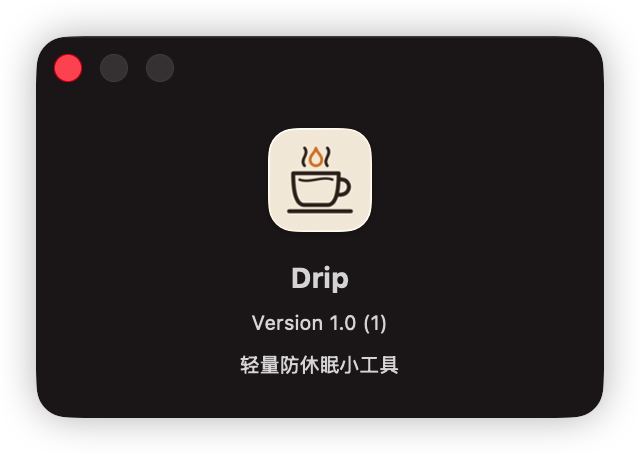

<div align="center">



# Drip

**一个轻量的原生菜单栏小工具，让你的 Mac 保持唤醒。**

一键开关 · 不占 Dock · 空闲时零 CPU

[](https://github.com/imelonkid/drip/releases/latest)
[](#系统要求)
[](https://swift.org)
[](https://developer.apple.com/xcode/swiftui/)
[](LICENSE)

[English](README.md) · 简体中文

</div>

---

<p align="center">
  
  &nbsp;
  
</p>

## 为什么用 Drip？

编译大项目、下载大文件、做演示或者开着远程会话的时候，你肯定不希望 Mac 自己睡着。Drip 是菜单栏里的一个咖啡杯小图标，打开它，Mac 就会一直保持唤醒，可以无限期，也可以只保持一段时间。

它相当于给 `caffeinate` 命令加了一个顺手的界面，平时安静地待在菜单栏里，不打扰你。

## 功能

- ☕ **一键开关**：保持唤醒时，咖啡杯图标会变成实心。
- ⏱️ **定时**：∞、15 / 30 / 45 分钟，或 1 / 4 / 8 / 12 小时。点一下时长就立即开始。
- ⏳ **剩余时间**：打开面板就能看到实时倒计时。
- 🖥️ **屏幕可选**：可以让屏幕保持常亮，也可以只阻止系统休眠，屏幕照常熄灭。
- 🚀 **登录时启动**，也可以设置成打开应用时自动开启。
- 🪶 **非常轻**：应用约 350 KB，没有后台轮询，没有第三方依赖。

## 原理

Drip 只持有一个 [IOKit 电源断言](https://developer.apple.com/documentation/iokit/1557092-iopmassertioncreatewithname)，和 `caffeinate`、视频播放器用的是同一套机制：

| 设置 | 断言类型 |
| --- | --- |
| 屏幕保持常亮（默认） | `PreventUserIdleDisplaySleep` |
| 允许屏幕熄灭 | `PreventUserIdleSystemSleep` |

定时模式只挂一个一次性定时器，到点就释放断言。后台没有任何周期性任务，倒计时也只在面板打开时刷新。随时可以用下面的命令确认它是否在生效：

```bash
pmset -g assertions | grep Drip
```

## 安装

### 直接下载

1. 在 [最新 Release](https://github.com/imelonkid/drip/releases/latest) 下载 `Drip-vX.Y.Z.dmg`。这是通用版，Apple 芯片和 Intel 都能用。
2. 打开 DMG，把 **Drip** 拖到 **Applications** 文件夹上。
3. Drip 没有经过苹果公证，第一次打开会被系统拦截。执行一次下面的命令解除隔离：

   ```bash
   xattr -dr com.apple.quarantine /Applications/Drip.app
   ```

   也可以先尝试打开，再到 **系统设置 → 隐私与安全性** 里点 **仍要打开**。

### 从源码构建

只需要 Xcode **命令行工具**，不用装完整的 Xcode：

```bash
git clone https://github.com/imelonkid/drip.git
cd drip
./build.sh install
```

这条命令会编译 release 版本、打包成 `Drip.app` 并做本地签名，然后复制到 `/Applications` 并启动。

> [!NOTE]
> 只想构建、不安装的话，运行 `./build.sh`，生成的应用在 `build/Drip.app`。

## 系统要求

- macOS 13 Ventura 及以上
- Apple 芯片或 Intel
- 从源码构建需要：Xcode 命令行工具（`xcode-select --install`）

## 项目结构

```
drip/
├── Sources/Drip/
│   ├── DripApp.swift         # MenuBarExtra 入口
│   ├── CaffeineModel.swift   # 电源断言、定时、设置
│   └── PanelView.swift       # 菜单栏面板界面
├── Resources/
│   ├── Info.plist            # LSUIElement（不显示 Dock 图标）
│   ├── AppIcon.icns
│   └── make_icon.swift       # 用代码绘制应用图标
├── .github/workflows/        # 推送 v* 标签 → 通用版构建 → 发布 Release
├── build.sh                  # 编译、打包、签名、安装
└── Package.swift
```

## 常见问题

<details>
<summary><b>合上盖子也能保持唤醒吗？</b></summary>

不能。合盖后 macOS 一定会休眠，除非处于外接显示器加电源的合盖模式。Drip 阻止的是“空闲休眠”。
</details>

<details>
<summary><b>提示无法打开应用？</b></summary>

Drip 只做了本地签名，没有经过苹果公证。自己编译安装的可以正常打开；下载的版本请执行一次 `xattr -dr com.apple.quarantine /Applications/Drip.app`，或者在 **系统设置 → 隐私与安全性** 里点 **仍要打开**。
</details>

<details>
<summary><b>「登录时启动」不生效？</b></summary>

请确认应用放在 `/Applications` 里，`./build.sh install` 会自动放到这个位置。
</details>

## 参与贡献

欢迎提 Issue 和 PR。Drip 会刻意保持小巧，能让它保持简单、轻量的改动最容易被合并。

## 许可证

[MIT](LICENSE) © melonkid
